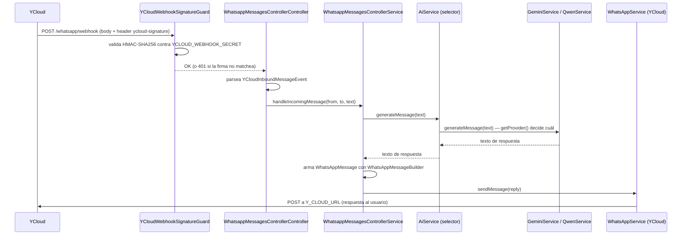

# Flujo de un mensaje entrante

## Paso a paso

1. **YCloud** llama a `POST /whatsapp/webhook` cuando el número de WhatsApp asociado recibe un mensaje.
2. **`YCloudWebhookSignatureGuard`** valida la firma HMAC (header `ycloud-signature`, formato `t=<timestamp>,v1=<firma>`) contra `YCLOUD_WEBHOOK_SECRET`, usando el **body crudo** (`request.rawBody`, habilitado en `main.ts` con `rawBody: true`).
3. **`WhatsappMessagesControllerController.receiveMessage`** parsea el body a `YCloudInboundMessageEvent` (la forma exacta del webhook de YCloud — vive en `infrastructure` porque es el formato de wire de un proveedor externo, no un concepto de dominio) y extrae `from`, `to`, `text.body`. Le pasa **strings sueltos** al use-case, nunca el DTO de YCloud completo — si no, `core` terminaría dependiendo de `infrastructure`.
4. **`WhatsappMessagesControllerService.handleIncomingMessage`** (el use-case) pide una respuesta vía `AiPort.generateMessage(text)`, arma un `WhatsAppMessage` (entidad de dominio) con `WhatsAppMessageBuilder` invirtiendo `from`/`to` (se responde al que escribió), y lo manda vía `WhatsAppPort.sendMessage(reply)`.
5. **`AiService`** (el adapter que implementa `AiPort`) decide internamente qué proveedor de IA usar y delega.
6. **`WhatsAppService`** arma el request HTTP hacia la API de YCloud (`Y_CLOUD_URL`) para enviar la respuesta.

## Lo que falta (no implementado todavía)

- **Grupos de WhatsApp**: el webhook de YCloud puede traer `groupId` en mensajes de grupo; hoy se ignora y siempre se responde al `from` individual.
- **Lógica de selección de IA real**: `AiService.getProvider()` devuelve siempre Qwen, sin ningún criterio de selección.
- **Persistencia**: no hay base de datos — no se guarda historial de conversación ni estado de usuario.
- **Debugging local del webhook**: los Dev Tunnels de VS Code/Cursor en modo "Private" bloquean el tráfico externo (como el de YCloud) antes de que llegue a la app local — hace falta "Public", o una herramienta como ngrok, para poder debuggear el webhook con breakpoints en local.
